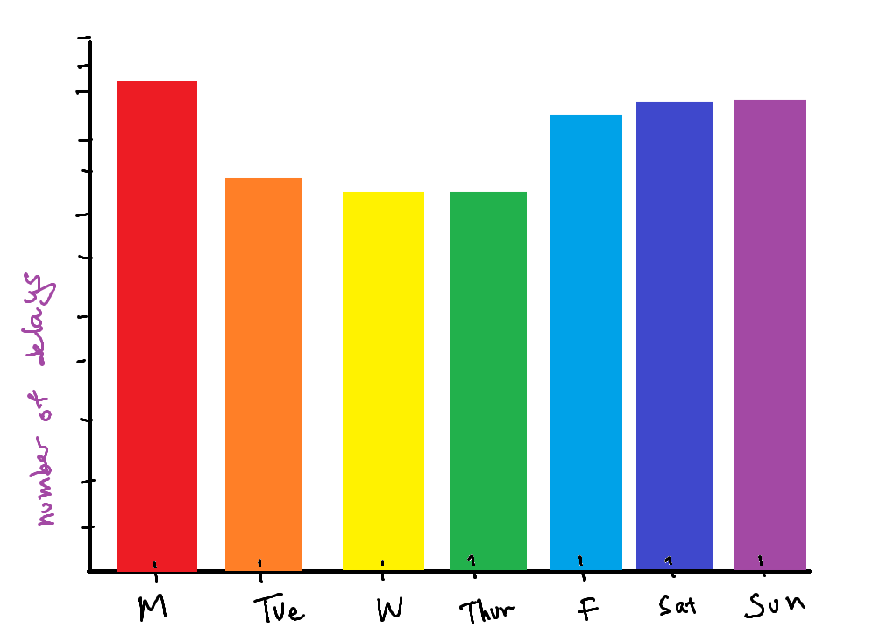
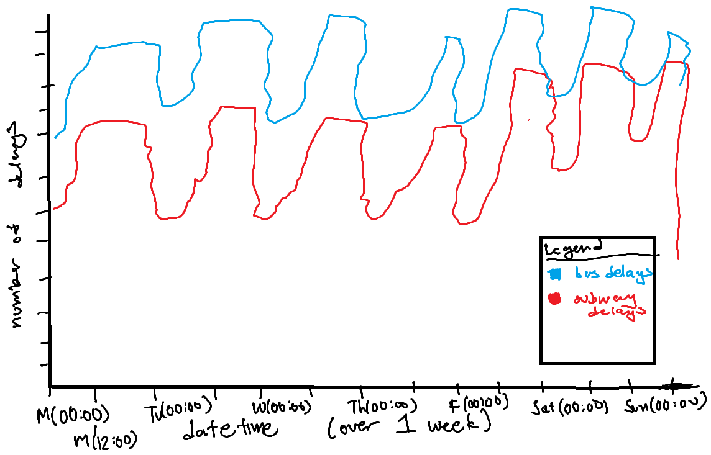
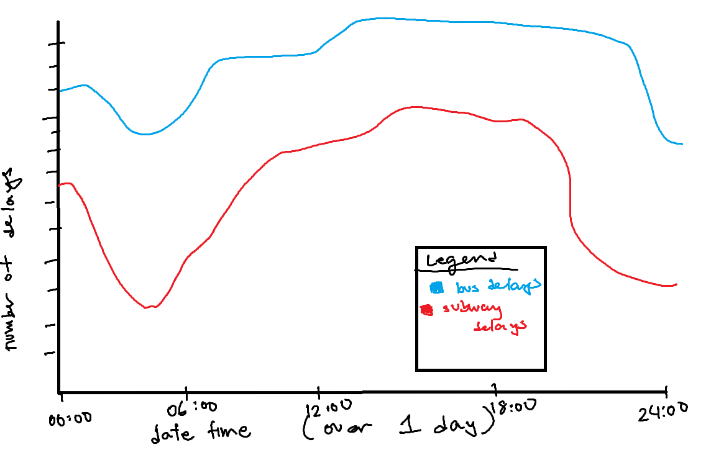

# TTC Analysis

## Paper Overview

This paper analyzes the different direct or indirect potential causes of delays that affect the TTC transit system. In particular the paper focuses on subway and bus delays in which commuters most commonly use. It was created with the intent to incite further in-depth analysis on the causes of the increase in delays.


## File Structure
```text
ttc_analysis/
├── .gitignore
├── LICENSE.md
├── README.md
├── ttc_analysis.Rproj
├── inputs
│   ├── data
│   │   ├── raw_data.csv
|   |   ├── filtered_or_selected_data.csv
│   │   └── ...
│   ├── sketches
│   │   ├── predicted_dataset_sketch.png
│   │   └── ...
├── outputs
│   ├── data
│   │   ├── cleaned_data.csv
│   │   |── ...
|   │   └── summaries
|   │       ├── summarized_data.csv
|   │       └── ...
│   ├── paper.pdf
│   ├── paper.qmd
│   └── references.bib
├── scripts
│   ├── 00-simulate_data.R
│   ├── 01-download_data.R
│   ├── 02-data_cleaning.R
│   ├── 03-parse_codes.R        // 03=> Converting code to descriptions 
|   |                           //  and grouping classes together
│   └── 04-summarise_data.R     // 04=> Averaging, summing and other ways
|                               //  of summarizing the data which is
|                               // then stored in outputs/data/summaries/*
└── ...
```

-   `input/data` contains the raw data collected from `opendatatoronto` and datasets that have been filtered and selected but not mutated.
-   `outputs/data` contains the cleaned dataset that was constructed from the scripts, the data that is used for analysis within the final report paper.
-   `outputs/data/summaries` contains summarized information from the datasets in the outer folder
    - using `dplyr`'s `summarise()` and `group_by()` as well as other base statistical functions to achieve these summaries.
-   `outputs/` (The outer folder) contains the resources for rendering the paper and the paper itself. (`paper.pdf`) 
-   `scripts` contains the R scripts used to simulate, download and clean data.


## LLM Statement

No LLMs were utilized in the creation of this paper.


## Sketches


**Sketch 1:** A bar graph displaying the potential correlation between delays and days of the week. The analysis actually shows the opposite, in which weekdays produce a higher amount of delays compared to weekends.




**Sketch 2 + 3:** A bar graph displaying the potential correlation between delays and the time of day. Related to `Sketch 1` as it deals with the traditional work cycle. This trend was shown to be realistic, peaking during rush hour, and sinking during night hours and operations.